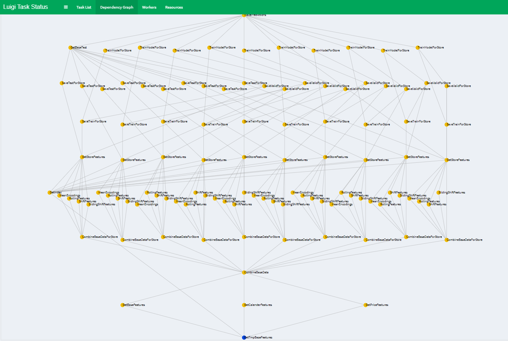

# kaggle-m5-pipeline

I tried to convert [this](https://www.kaggle.com/kyakovlev/m5-three-shades-of-dark-darker-magic) 
notebook (by Konstantin Yakovlev) into luigi pipeline.

I choose luigi as convinient flow manager for projects of similar size.
This is just a starter solution, I will improve it this later (probably in the end of the competiotion).

Using this template you can easily scale and extend the pipeline with more new tasks, new features, new models.

Main goals for me are:
- to improve the generic part of pipeline to reuse it later in upcoming competitions
- show to other participants that it is indeed easy to stop using only notebooks and move on into 
scalable, production-almost-ready, reproducible framework

how to run:
- install luigi
- run luigi daemon in cmd `luigid`
- run tasks.py
- in your browser navigate to `http://localhost:8082/` and you should see something like:

Code is mostly uncommented due to lack of spare time, sorry about that.